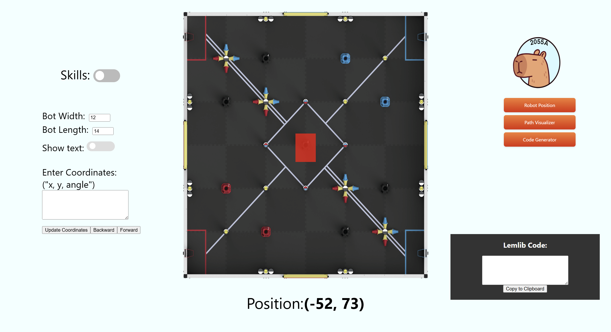

# CapyCodeHub

A web toolkit for VEX Robotics Competition (VRC) teams, built by Team 2055 (Capybaras). It combines two things teams normally need separate tools for:

1. **Autonomous programming aids** — figure out exact field coordinates, plan paths, and generate LemLib movement code straight from the browser.
2. **Scouting and event data** — a browser-based replica of the VEX Via app, so you can browse events, match schedules, rankings, skills, and awards without installing anything.

Everything runs client-side against the public VEX events API, plus a small Flask service for computing advanced team statistics.

## Features

### Robot position tracking (`/tracker`)

Hover anywhere on a scaled field image to read the corresponding field coordinate in inches. Configure your robot's width and length and the tool draws a to-scale bounding box, so you can check clearances and starting positions before touching a controller. Toggle between the match field and the skills field layout.

### Path visualizer (`/path-record`)

Same coordinate system as the tracker, but records a sequence of positions so you can lay out and review an autonomous route point by point.

### LemLib code generator (`/code-generator`)

Paste a list of waypoints as `x, y, angle` (one per line) and it emits ready-to-use LemLib calls:

```cpp
chassis.setPose(0, 0, 0);
chassis.moveTo(24, 0, 90, 1450);
```

The first waypoint becomes `setPose`; the rest become `moveTo` calls. Timeouts are estimated from the distance between consecutive points using an assumed travel speed, with an 800 ms floor. A step-through control moves a to-scale robot along the path so you can sanity-check the route visually, and the output can be copied to the clipboard in one click.



### Event browser (`/vexvia`)

Searchable, paginated list of tournaments. Each event links through to:

- **Event home** (`/vexvia/comps/:event_id`) — dates, venue, event level, and a list of divisions, plus entry points to skills and awards.
- **Matches** (`/vexvia/comps/:event_id/division/:division_id/matches`) — match schedule grouped by elimination level (qualification, round of 16, quarterfinals, semifinals, finals), division rankings with WP/AP/SP and win-loss-tie records, the team list, and a computed stats tab.
- **Skills** (`/vexvia/comps/:event_id/skills`) — driver and programming skills rankings, split by type.
- **Awards** (`/vexvia/comps/:event_id/awards`) — awards presented at the event.

Because a single division can exceed the API's 250-results-per-page cap, the match schedule fetch pages through all results before rendering.

### Team scouting (`/vexvia/teams`)

Enter a team number (e.g. `2055A`) to jump to that team's page:

- **Team home** (`/vexvia/teams/:team_id`) — team info alongside their season skills scores, event rankings, match history, and awards.
- **Team at an event** (`/vexvia/teams/:team_id/:event_id`) — that team's performance scoped to a single competition.

### Advanced statistics (OPR / DPR / CCWM)

The stats tab posts a division's team and match data to a Flask endpoint that solves for each team's contribution using least squares over qualification matches:

- **OPR** (Offensive Power Rating) — estimated points a team adds to their alliance's score.
- **DPR** (Defensive Power Rating) — estimated points a team allows the opposing alliance.
- **CCWM** (Calculated Contribution to Winning Margin) — `OPR - DPR`.

Results are sortable by any of the three metrics.

### Worlds division predictors (`/predictor`, `/predictorMS`)

Takes the registered team list for the World Championship and distributes teams across divisions in the order VEX historically uses, giving an early guess at division assignments. Separate pages for high school and middle school.

## Project structure

```
src/
  App.js                 Route definitions
  constants.js           API_BASE_URL for the VEX API
  pages/
    home.js              Landing page with links to each tool
    scouting.js          Team number search
    vexvia.js            Event list / search
    vexvia/              Event detail pages (matches, skills, awards, dropdowns, navbar)
    teams/               Team detail pages
    postrack/            Tracker, path visualizer, code generator
    division-predictor.js, ms-division-predictor.js
  components/            Reusable display + UI pieces (BotDrawer, MatchDisplay, ...)
  component-styles/, page-styles/, styles/    CSS, mirroring the JS layout
  images/                Field images and logos
server/
  api/index.py           Flask OPR/DPR/CCWM endpoint
scripts/                 Python helpers for building lookup tables from the API
legacy-server/           Older Python/Firebase experiments
```

Styles are organized to mirror the component tree: a page at `pages/vexvia/matches.js` has its stylesheet at `page-styles/vexvia/matches.css`.

## Getting started

Requires Node.js and npm.

```bash
npm install
npm start
```

The app runs at http://localhost:3000.

### Running the stats service locally

The stats tab points at a deployed endpoint by default. To run it yourself:

```bash
cd server
pip install -r requirements.txt
python api/index.py
```

It serves `POST /stats` (expects `{ teamData, matchData }`) and `GET /test1` as a health check. Update the fetch URL in `src/pages/vexvia/matches.js` to point at your local instance.

## Available scripts

| Command | Description |
| --- | --- |
| `npm start` | Start the dev server with hot reload |
| `npm run build` | Production build into `build/` |
| `npm test` | Run tests in watch mode |
| `npm run deploy` | Build and publish to GitHub Pages via `gh-pages` |

